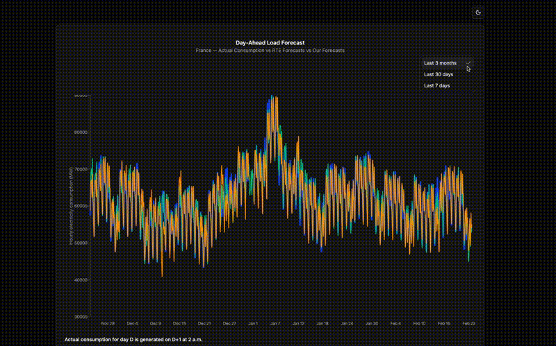
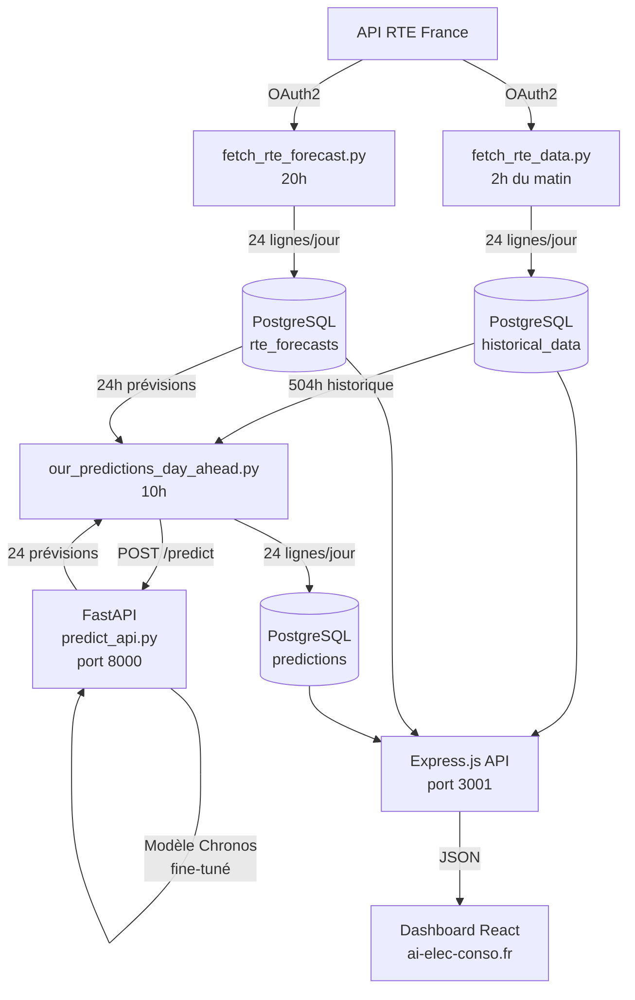
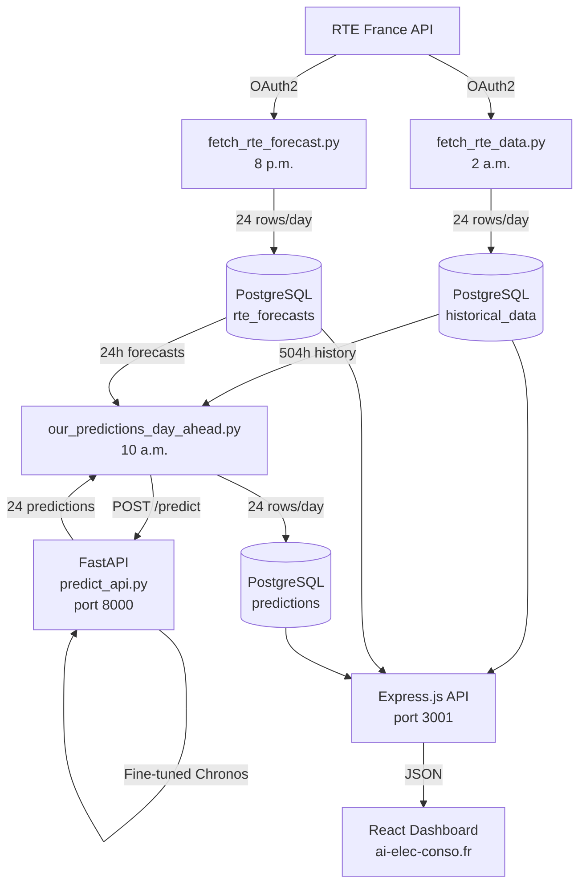

# ⚡ Electricity Consumption Dashboard

🌐 **[https://ai-elec-conso.fr](https://ai-elec-conso.fr)** | 📄 MIT License | Stack: React • FastAPI • PostgreSQL • Chronos • Docker • Nginx • PM2 • ETL

English version below

---

> Ce projet est né d'une conviction simple : pour trader efficacement sur le marché de l'électricité, il faut anticiper. La consommation électrique influence directement le prix spot de l'énergie — comprendre et prévoir sa trajectoire, c'est se donner un avantage décisif.
>
> Ce dashboard a été conçu pour centraliser, visualiser et prédire la consommation électrique française en temps quasi réel. Il combine des données officielles de RTE France avec un modèle de prévision de pointe (Chronos, développé par Amazon Research), fine-tuné spécifiquement sur les données de consommation française.
>
> Le résultat : un outil autonome, entièrement automatisé, capable de générer chaque jour des prévisions J+1 et de les comparer aux prévisions officielles de RTE — le tout accessible depuis un dashboard interactif.

🌐 **Dashboard en ligne : [https://ai-elec-conso.fr](https://ai-elec-conso.fr)**



### 🎯 Présentation

Le dashboard affiche et compare en temps réel :
- **La consommation réelle** issue de l'API RTE France (mise à jour quotidienne à 2h du matin)
- **Les prévisions officielles RTE** pour le jour J (mises à jour quotidiennement à 20h)
- **Nos prévisions** générées par le modèle de fondation Chronos fine-tuné via FastAPI (mises à jour quotidiennement à 10h)

### 🏗️ Architecture du projet



### 🔄 Pipeline automatisé

| Script | Planification | Description |
|--------|--------------|-------------|
| `fetch_rte_data.py` | Chaque jour à 2h | Récupère la consommation réelle du jour J |
| `start_api.sh` | Au démarrage + 9h50 | Redémarre FastAPI |
| `our_predictions_day_ahead.py` | Chaque jour à 10h | Génère nos prévisions via FastAPI |
| `fetch_rte_forecast.py` | Chaque jour à 20h | Récupère les prévisions RTE du jour J |

> 📊 **Note sur les données** : Les données de consommation sont récupérées via l'endpoint `Consumption` de l'API RTE France. Les données brutes sont fournies à une granularité de **15 minutes** (96 points par jour), puis agrégées en **moyennes horaires** (24 points par jour) avant d'être stockées dans PostgreSQL.


### 🤖 Le modèle Chronos

[Chronos](https://github.com/amazon-science/chronos-forecasting) est un **modèle de fondation préentraîné pour les séries temporelles**, développé par Amazon Research. Contrairement aux modèles classiques (ARIMA, Prophet) qui nécessitent d'être entraînés spécifiquement sur chaque série temporelle, Chronos adopte une approche similaire aux grands modèles de langage (LLM) : il est préentraîné sur des **milliers de séries temporelles issues de domaines variés** (finance, énergie, météo, santé...), ce qui lui confère une capacité de généralisation remarquable. Notamment, Chronos se distingue par ses **performances exceptionnelles en mode zero-shot** — c'est-à-dire qu'il est capable de générer des prévisions précises sur des séries temporelles qu'il n'a jamais vues lors de l'entraînement, sans aucun fine-tuning préalable. Cette propriété en fait un modèle particulièrement polyvalent et adapté à des cas d'usage variés.

#### Comment fonctionne Chronos ?

Chronos transforme les valeurs numériques d'une série temporelle en **tokens** (comme un LLM tokenise du texte), puis utilise une architecture **Transformer** pour apprendre les patterns temporels. Pour générer une prévision, il prédit les tokens suivants de manière probabiliste.

#### Fine-tuning sur les données françaises

Dans ce projet, le modèle `chronos-t5-small` a été **fine-tuné** sur les données historiques de consommation électrique française issues de RTE, afin d'adapter ses prédictions aux spécificités du réseau français :
- Cycles journaliers (pic matin/soir)
- Cycles hebdomadaires (week-end vs jours ouvrés)
- Saisonnalité annuelle (hiver vs été)

Le modèle fine-tuné est exposé via une **API FastAPI** qui reçoit les 504 dernières heures de consommation et retourne les 24 prévisions pour le lendemain.

### 🛠️ Stack technique

| Couche | Technologie | Version |
|--------|-------------|---------|
| Frontend | React.js + Vite | 19.x / 7.x |
| Frontend | Recharts + shadcn/ui + Tailwind | 2.x / 4.x |
| Backend API | Express.js + Node.js | 5.x |
| Modèle ML | Chronos (Amazon, fine-tuné) | 2.2.2 |
| API Modèle | FastAPI + Uvicorn | 0.129.x |
| Base de données | PostgreSQL (Docker) | 15 |
| Déploiement | VPS OVH + Nginx + PM2 | - |
| HTTPS | Let's Encrypt (Certbot) | - |
| Source de données | API RTE France (OAuth2) | - |
| Automatisation | Cron jobs | - |

### ⚙️ Installation & Configuration (développement local)

#### Prérequis
- Node.js >= 18
- Python >= 3.10
- Docker

#### 1. Cloner le dépôt
```bash
git clone https://github.com/adecholaA1/electricity_consumption_dashbord.git
cd electricity_consumption_dashbord
```

#### 2. Configurer les variables d'environnement
```bash
cp .env.example .env
# Remplir .env avec vos identifiants API RTE et les paramètres PostgreSQL
```

#### 3. Démarrer la base de données
```bash
docker run --name trading_pg_db \
  -e POSTGRES_DB=trading_data \
  -e POSTGRES_USER=dev_user \
  -e POSTGRES_PASSWORD=your_password \
  -v pg_data:/var/lib/postgresql/data \
  -p 5432:5432 \
  -d postgres:15-alpine
```

#### 4. Initialiser la base de données
```bash
docker exec -i trading_pg_db psql -U dev_user -d trading_data < backend/backup/trading_data_3_tables.sql
```

#### 5. Installer les dépendances Python
```bash
python3 -m venv venv
source venv/bin/activate
pip install -r requirements.txt
```

#### 6. Démarrer l'API du modèle ML
```bash
chmod +x scripts/start_api.sh
bash scripts/start_api.sh
```

#### 7. Démarrer le backend
```bash
cd backend
npm install
node index.js
```

#### 8. Démarrer le frontend
```bash
cd frontend
npm install
npm run dev
```

### 🚀 Déploiement (VPS OVH)

Le projet est déployé sur un VPS OVH (6 vCores, 12 Go RAM, Ubuntu 25.04) avec :

- **Nginx** comme reverse proxy (HTTP → HTTPS)
- **PM2** pour gérer les processus Node.js et FastAPI
- **Let's Encrypt** pour le certificat SSL
- **Cron jobs** pour l'automatisation quotidienne

```bash
# Démarrer les services avec PM2
pm2 start backend/index.js --name "backend"
pm2 start scripts/start_api.sh --name "fastapi"
pm2 save
pm2 startup
```

### 📡 Endpoints API

| Méthode | Route | Description |
|---------|-------|-------------|
| GET | `/api/data` | Données combinées (3 séries) |
| GET | `/api/data/real` | Consommation réelle uniquement |
| GET | `/api/data/predictions` | Nos prévisions |
| GET | `/api/data/rte-forecasts` | Prévisions officielles RTE |
| GET | `/api/status` | Statut du système |
| GET | `/api/health` | Santé de l'API |

### 📄 Licence

Licence MIT — libre d'utilisation, de modification et de distribution.

### 🙏 Sources de données

- Données de consommation électrique : [API RTE France](https://data.rte-france.com)
- Modèle de prévision : [Chronos by Amazon](https://github.com/amazon-science/chronos-forecasting)

---

> This project was born from a simple conviction: to trade electricity markets effectively, you need to anticipate. Electricity consumption directly influences the spot price of energy — understanding and forecasting its trajectory is a decisive advantage.
>
> This dashboard was designed to centralize, visualize and forecast French electricity consumption in near real time. It combines official RTE France data with a state-of-the-art forecasting model (Chronos, developed by Amazon Research), fine-tuned specifically on French consumption data.
>
> The result: a fully autonomous, automated tool capable of generating daily J+1 forecasts and comparing them against RTE's official forecasts — all accessible from an interactive dashboard.

🌐 **Live Demo: [https://ai-elec-conso.fr](https://ai-elec-conso.fr)**


### 🎯 Overview

The dashboard displays and compares in real time:
- **Actual consumption** data from RTE France (updated daily at 2 a.m.)
- **RTE official forecasts** for day J (updated daily at 8 p.m.)
- **Our model forecasts** generated by a fine-tuned Chronos model via FastAPI (updated daily at 10 a.m.)

### 🏗️ Project Architecture



### 🔄 Automated Pipeline

| Script | Schedule | Description |
|--------|----------|-------------|
| `fetch_rte_data.py` | Daily at 2 a.m. | Fetches actual consumption for day J |
| `start_api.sh` | On boot + 9:50 a.m. | Restarts FastAPI |
| `our_predictions_day_ahead.py` | Daily at 10 a.m. | Generates our forecasts via FastAPI |
| `fetch_rte_forecast.py` | Daily at 8 p.m. | Fetches RTE forecasts for day J |

> 📊 **Data note**: Consumption data is retrieved via the `Consumption` endpoint of the RTE France API. Raw data is provided at a **15-minute granularity** (96 data points per day), then aggregated into **hourly averages** (24 data points per day) before being stored in PostgreSQL.


### 🤖 The Chronos Model

[Chronos](https://github.com/amazon-science/chronos-forecasting) is a **pretrained foundation model for time series forecasting**, developed by Amazon Research. Unlike classical models (ARIMA, Prophet) that need to be trained on each specific time series, Chronos takes an approach similar to Large Language Models (LLMs): it is pretrained on **thousands of time series from diverse domains** (finance, energy, weather, healthcare...), giving it remarkable generalization capabilities. Notably, Chronos stands out for its **exceptional zero-shot performance** — meaning it can generate accurate forecasts on time series it has never seen during training, without any prior fine-tuning. This property makes it a particularly versatile model, well-suited for a wide range of use cases.

#### How does Chronos work?

Chronos transforms numerical time series values into **tokens** (just like an LLM tokenizes text), then uses a **Transformer architecture** to learn temporal patterns. To generate forecasts, it predicts the next tokens in a probabilistic manner.

#### Fine-tuning on French electricity data

In this project, the `chronos-t5-small` model was **fine-tuned** on historical French electricity consumption data from RTE, to adapt its predictions to the specificities of the French grid:
- Daily cycles (morning/evening peaks)
- Weekly cycles (weekends vs. working days)
- Annual seasonality (winter vs. summer)

The fine-tuned model is exposed via a **FastAPI** endpoint that receives the last 504 hours of consumption and returns 24 predictions for the next day.

### 🛠️ Tech Stack

| Layer | Technology | Version |
|-------|-----------|---------|
| Frontend | React.js + Vite | 19.x / 7.x |
| Frontend | Recharts + shadcn/ui + Tailwind | 2.x / 4.x |
| Backend API | Express.js + Node.js | 5.x |
| ML Model | Chronos (Amazon, fine-tuned) | 2.2.2 |
| Model API | FastAPI + Uvicorn | 0.129.x |
| Database | PostgreSQL (Docker) | 15 |
| Deployment | OVH VPS + Nginx + PM2 | - |
| HTTPS | Let's Encrypt (Certbot) | - |
| Data Source | RTE France API (OAuth2) | - |
| Automation | Cron jobs | - |

### ⚙️ Installation & Setup (local development)

#### Prerequisites
- Node.js >= 18
- Python >= 3.10
- Docker

#### 1. Clone the repository
```bash
git clone https://github.com/adecholaA1/electricity_consumption_dashbord.git
cd electricity_consumption_dashbord
```

#### 2. Configure environment variables
```bash
cp .env.example .env
# Edit .env with your RTE API credentials and PostgreSQL settings
```

#### 3. Start the database
```bash
docker run --name trading_pg_db \
  -e POSTGRES_DB=trading_data \
  -e POSTGRES_USER=dev_user \
  -e POSTGRES_PASSWORD=your_password \
  -v pg_data:/var/lib/postgresql/data \
  -p 5432:5432 \
  -d postgres:15-alpine
```

#### 4. Initialize the database
```bash
docker exec -i trading_pg_db psql -U dev_user -d trading_data < backend/backup/trading_data_3_tables.sql
```

#### 5. Install Python dependencies
```bash
python3 -m venv venv
source venv/bin/activate
pip install -r requirements.txt
```

#### 6. Start the ML model API
```bash
chmod +x scripts/start_api.sh
bash scripts/start_api.sh
```

#### 7. Start the backend
```bash
cd backend
npm install
node index.js
```

#### 8. Start the frontend
```bash
cd frontend
npm install
npm run dev
```

### 🚀 Deployment (OVH VPS)

The project is deployed on an OVH VPS (6 vCores, 12 GB RAM, Ubuntu 25.04) with:

- **Nginx** as reverse proxy (HTTP → HTTPS)
- **PM2** to manage Node.js and FastAPI processes
- **Let's Encrypt** for SSL certificate
- **Cron jobs** for daily automation

```bash
# Start services with PM2
pm2 start backend/index.js --name "backend"
pm2 start scripts/start_api.sh --name "fastapi"
pm2 save
pm2 startup
```

### 📡 API Endpoints

| Method | Route | Description |
|--------|-------|-------------|
| GET | `/api/data` | Combined data (all 3 series) |
| GET | `/api/data/real` | Actual consumption only |
| GET | `/api/data/predictions` | Our model predictions |
| GET | `/api/data/rte-forecasts` | RTE official forecasts |
| GET | `/api/status` | System status & counts |
| GET | `/api/health` | API health check |

### 📄 License

MIT License — feel free to use, modify and distribute.

### 🙏 Data Sources

- Electricity consumption data: [RTE France API](https://data.rte-france.com)
- Forecasting model: [Chronos by Amazon](https://github.com/amazon-science/chronos-forecasting)
